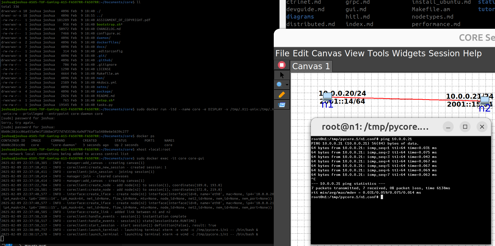

# Installing CORE and EMANE using Docker

The documentation provides a guide on how to install CORE 
and EMANE using the Dockerfile's in the CORE repo which builds 
off Ubuntu 22.04 images:
https://coreemu.github.io/core/install_docker.html
https://github.com/joshuamhtsang/core/blob/master/docs/install_docker.md

Update 09/02/2025:
I followed the `docker build`, `docker run` and `docker exec` terminal
commands and managed to get CORE running!

